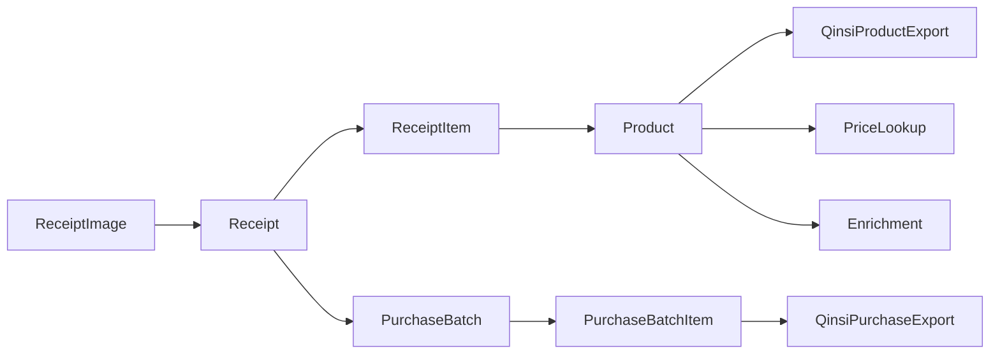

# ARCHITECTURE.md

Last updated: 2026-08-27.

## Runtime

- FastAPI app: `app/main.py`
- ORM: SQLAlchemy 2.x models in `app/models.py`
- Database: SQLite through `app/db.py` and `app/config.py`
- Templates: Jinja in `app/templates/`
- Static assets: `app/static/`
- Migrations: Alembic in `migrations/versions/`
- Tests: pytest in `tests/`
- Dev port: `8020`

`run_dev_8020_py314.bat` runs `alembic upgrade head`, then starts `uvicorn app.main:app --host 0.0.0.0 --port 8020` without `--reload`. Python changes require restarting through `restart_dev_8020_py314.bat`.

## Module Map

| Area | Main Code | Tests |
|---|---|---|
| Receipt upload/OCR/import/review | `app/main.py`, `app/services.py`, `app/schemas.py` | `tests/test_receipts.py`, `tests/test_stage2.py`, `tests/test_workflow_dedup_zip.py`, `tests/test_upload_compatibility.py` |
| Product identity and editing | `app/product_identity.py`, `app/product_admin.py`, `app/local_product.py` | `tests/test_products_and_health.py`, `tests/test_jan_governance.py` |
| Product merge/placeholder cleanup | `app/product_merge.py`, `app/product_specs.py` | `tests/test_product_merge.py`, `tests/test_product_placeholder_cleanup.py` |
| QinSi goods/product-master import | `app/qinsi_goods_import.py`, `app/qinsi_product_master_import.py` | `tests/test_qinsi_goods_import.py`, `tests/test_qinsi_product_master_import.py` |
| Receipt to purchase batches | `app/purchase_service.py`, `app/receipt_pricing.py` | `tests/test_purchase_batches.py`, `tests/test_qinsi_purchase_exports.py` |
| QinSi exports/import helpers | `app/qinsi_export.py`, `app/qinsi_import.py` | `tests/test_qinsi_purchase_exports.py`, `tests/test_product_import_matching_tracking.py` |
| Field purchase | `app/field_purchase.py`, `app/static/field_purchase.js`, `app/templates/field_purchase.html` | `tests/test_field_purchase_p0.py` |
| Price lookup/providers | `app/price_service.py`, `app/price_providers.py`, `app/provider_config.py` | `tests/test_price_lookup.py` |
| Enrichment/translation/images | `app/product_enrichment.py`, `app/product_image_localization.py`, `app/deepseek_service.py` | `tests/test_product_enrichment.py`, `tests/test_product_image_localization.py` |
| Stores, locations, analytics, restock | `app/store_service.py`, `app/location_service.py`, `app/analytics_service.py`, `app/restock_service.py` | `tests/test_locations.py`, `tests/test_restock_lists.py`, `tests/test_purchase_analytics.py` |
| Inventory snapshots and watches | `app/qinsi_inventory.py`, `app/watch_service.py`, `app/monitor_service.py`, `app/monitor_scheduler.py` | `tests/test_qinsi_inventory_snapshots.py`, `tests/test_product_watches.py`, `tests/test_price_monitoring.py` |

`docs/CODE_MAP.md` is still useful as a compact historical map, but this file is the current architecture entry.

## Data Flows

Receipt flow: uploads create `receipt_batches` and `receipt_images`; recognition ZIP jobs create `zip_package_jobs` and `zip_package_items`; manual ChatGPT JSON import stores `ai_recognition_runs`, `receipts`, and `receipt_items`; confirmation creates purchase-batch records.

Product/barcode flow: matching uses `Product.jan`, `ProductBarcode`, safe QinSi-derived aliases, and confirmed aliases. Ambiguous barcode results are surfaced to the user. Product merge and placeholder cleanup migrate references while preserving facts.

QinSi flow: product-master import previews rows into `qinsi_import_batches` and `qinsi_goods_import_rows`, then applies confirmed rows to `products`, `product_barcodes`, `qinsi_product_mappings`, and operation logs. Conflict decisions persist in `qinsi_conflict_resolutions`.

Purchase-batch QinSi exports use `qinsi_purchase_export_jobs`, `qinsi_purchase_export_lines`, and `qinsi_purchase_export_line_sources`. New-product exports use `qinsi_export_jobs`, `qinsi_export_lines`, and `qinsi_export_line_sources`.

Price/enrichment flow: price lookup creates `price_search_runs`, provider attempts, offers, and lookup histories. Enrichment tasks and candidates hold online completion sources before accepted product updates.

Inventory flow: QinSi inventory snapshots are timestamped observations in `qinsi_inventory_snapshots` and `qinsi_inventory_snapshot_lines`; they do not become JBA-owned current inventory.
